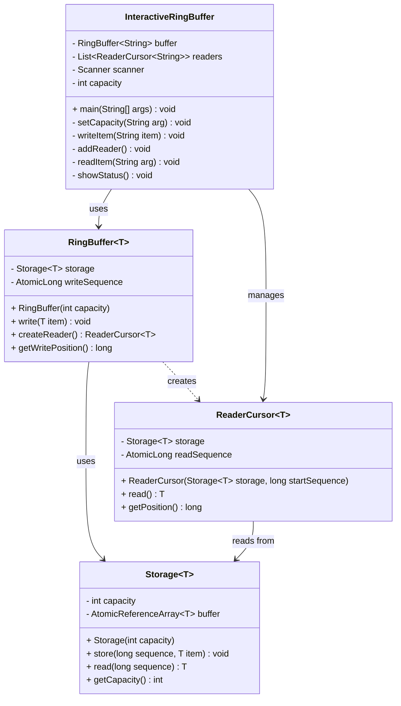
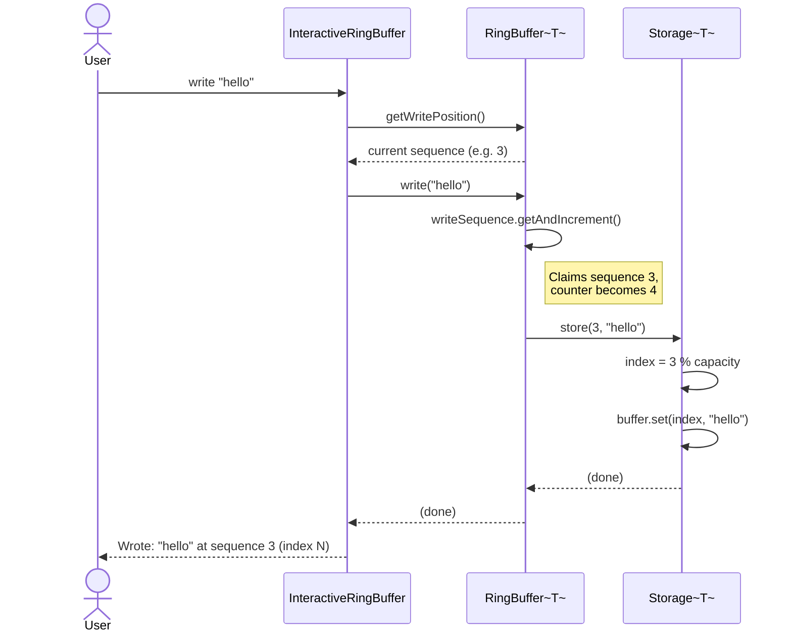
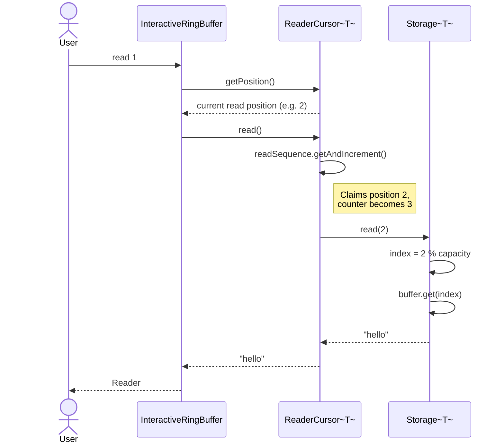

# Ring Buffer — Multiple Readers, Single Writer

## Project Overview

This project implements a **Ring Buffer** (also known as a Circular Buffer) in Java that supports a single writer and multiple independent readers. A ring buffer is a fixed-size data structure that uses a single, fixed-size buffer as if it were connected end-to-end in a circle. When the buffer is full, new data overwrites the oldest entries, making it ideal for streaming or producer-consumer scenarios where older data can be discarded.

Key characteristics of this implementation:

- Fixed capacity set at creation time
- One writer that continuously advances a write position
- Multiple readers, each maintaining their own independent read position
- Reading by one reader does not affect or remove data for any other reader
- If the writer laps a slow reader, that reader silently skips the overwritten data (the slot returns `null` or stale data)
- Thread-safe positions using `AtomicLong` and `AtomicReferenceArray`

---

## Design & Class Responsibilities

The solution is split into four classes, each with a single, well-defined responsibility. This follows the **Single Responsibility Principle** and avoids the "everything in one class" anti-pattern.

### `Storage<T>`

Owns the underlying data array. It holds an `AtomicReferenceArray<T>` of fixed size and is responsible for mapping a logical sequence number to a physical array index using modular arithmetic (`sequence % capacity`). It knows nothing about writers or readers — it only stores and retrieves values at a given sequence.

### `RingBuffer<T>`

Acts as the single-writer entry point. It holds a monotonically increasing `AtomicLong` write sequence counter. When `write(item)` is called, it claims the next sequence number, delegates storage to `Storage`, and advances the counter. It also serves as a factory for `ReaderCursor` objects, creating each new reader starting at the current write position.

### `ReaderCursor<T>`

Represents one independent reader. Each instance has its own `AtomicLong` read sequence counter, starting at the position it was created. Calling `read()` retrieves the item at the current read position from `Storage` and then advances the reader's position by one. Because each reader has its own counter, readers never interfere with each other.

### `InteractiveRingBuffer`

A command-line demo application that wires everything together for manual testing. It parses user commands (`capacity`, `write`, `addreader`, `read`, `status`, `exit`) and delegates to the appropriate classes. It holds no business logic of its own — it is purely a user interface.

---

## UML Class Diagram



---

## UML Sequence Diagram — `write()`

This diagram shows the full chain of calls when a user types `write hello` in the interactive demo.



---

## UML Sequence Diagram — `read()`

This diagram shows the full chain of calls when a user types `read 1` to have Reader #1 read the next item.



---

## How to Run / Test the Project

### Prerequisites

- **Java 11 or higher** installed (`java -version` to check)
- The four source files in the same package folder: `OO/Assignment_2/`

### Compiling

From the root of your project (the directory that contains the `OO` folder):

```bash
javac OO/Assignment_2/Storage.java \
      OO/Assignment_2/ReaderCursor.java \
      OO/Assignment_2/RingBuffer.java \
      OO/Assignment_2/InteractiveRingBuffer.java
```

### Running the Interactive Demo

```bash
java OO.Assignment_2.InteractiveRingBuffer
```

You will see a prompt `>`. Available commands:

| Command | Description |
|---|---|
| `capacity <N>` | Create a new ring buffer with capacity N |
| `write <item>` | Write a string item into the buffer |
| `addreader` | Add a new independent reader |
| `read <N>` | Reader #N reads its next item |
| `status` | Print the buffer size, write position, and all reader positions |
| `exit` | Quit the program |

### Example Session

The following walkthrough demonstrates core behaviour including overwriting and independent readers.

```
> capacity 3
Created buffer with capacity 3

> addreader
Added Reader #1 (starts at position 0)

> addreader
Added Reader #2 (starts at position 0)

> write A
Wrote: "A" at sequence 0 (index 0)

> write B
Wrote: "B" at sequence 1 (index 1)

> write C
Wrote: "C" at sequence 2 (index 2)

> read 1
Reader #1: "A" (from position 0)

> read 1
Reader #1: "B" (from position 1)

> write D
Wrote: "D" at sequence 3 (index 0)   ← overwrites "A"

> read 2
Reader #2: "D" (from position 0)     ← Reader #2 missed "A"

> status
Buffer capacity: 3
Next write position: 4
Number of readers: 2
  Reader #1 next read at position 2
  Reader #2 next read at position 1

> exit
Goodbye!
```

### What to Observe

- **Independent readers**: Reader #1 and Reader #2 each track their own position; one reading does not move the other.
- **Overwrite behaviour**: When `D` is written at sequence 3, it overwrites index 0 (where `A` was). Reader #2, which had not yet read position 0, now reads `D` instead of `A` — this is the expected "slow reader misses data" behaviour.
- **No blocking**: The writer never waits; it always overwrites the oldest slot.